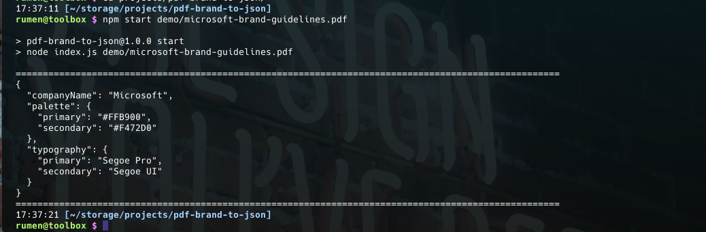

# PDF brand to JSON
Extracts information from brand guidelines `.pdf` file using AI and outputs json formatted string.



> **Warning** Use the output only as suggestions. Results may vary depending on the information in the .pdf file and the provided questions. Always validate the accuracy of the output and the values.

#### Requirements
* node >= 20.x
* npm >= 10.x

## Get started
1. Install dependencies
```sh
$ npm i
```
2. Create your `.env` file from the `.env.example` template file
```sh
$ cp .env.example .env
```
3. Add value to every environment variable
4. Start the script and provide the path to your `.pdf` document. (There are example files which you could use in the `demo/` folder)
```sh
$ npm start demo/microsoft-brand-guidelines.pdf
```

### Tech stack
* [Open AI API](https://platform.openai.com/docs/overview)
* [Langchain](https://js.langchain.com/v0.2/docs/introduction/)